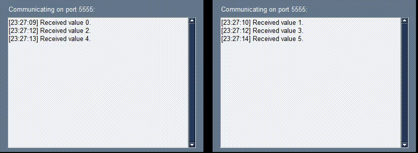

# TcpPingPong
Python TCP socket example, where the same class can act as server or client depending on which of its instance gets hold of a specific localhost port first. Special emphasis is put on error handling and multithreading.

Run _graphics.py_ and/or _communication.py_ from two separate terminals.

Tested on Windows 11.
